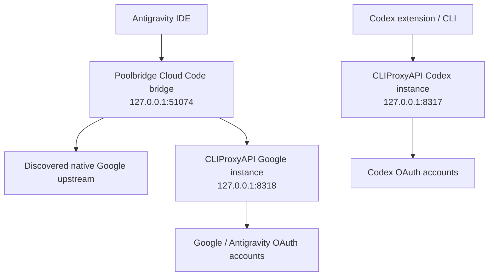
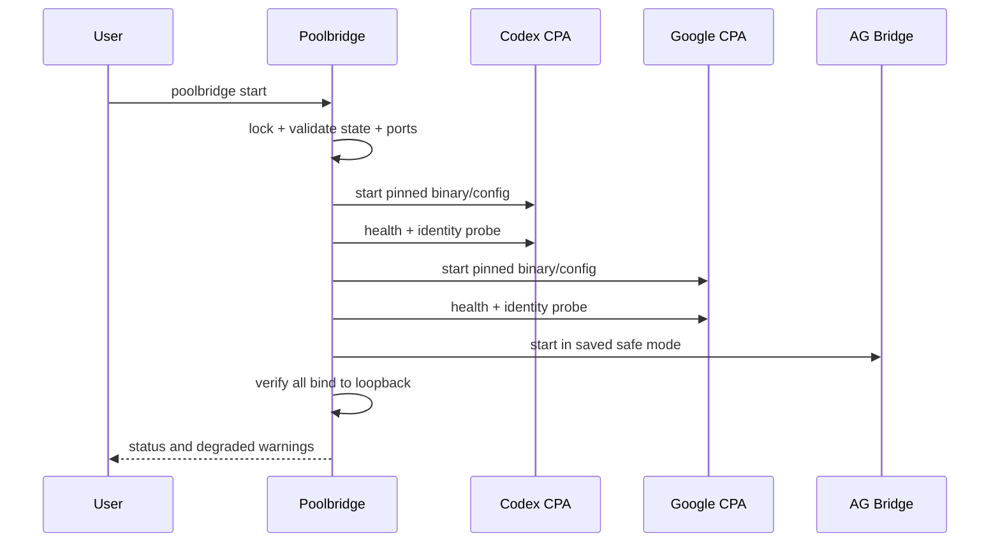

# System Architecture

## Context



Only an exact donor generation request follows `BR -> GP`. Model catalog and non-donor requests follow `BR -> NATIVE`. Under Poolbridge-managed state, no connection exists from Codex clients to the Google instance or from the bridge to the Codex instance. Unexpected opposite-provider auth material is an integrity violation that must fail closed before provider traffic is allowed.

## Components

### `poolbridge.exe`

Responsibilities:

- discover target applications and versions;
- acquire and verify a pinned CLIProxyAPI release;
- generate instance-specific configuration and secrets;
- start, supervise and stop two child processes;
- initiate upstream OAuth and poll status;
- maintain non-secret credential metadata and eligibility;
- run the Antigravity loopback bridge;
- patch/restore owned IDE configuration keys;
- expose CLI commands, doctor output and sanitized evidence.

It does not own provider tokens, protocol evolution, quota logic, model execution, or credential rotation internals.

### Google CLIProxyAPI instance

- Default proposed address: `127.0.0.1:8318`.
- Separate management secret and client API key.
- Auth directory contains Google/Antigravity credentials only.
- Bridge uses a provider-specific Gemini-compatible endpoint proven during Phase 0.
- Session affinity enabled only when the pinned schema confirms the fields.

### Codex CLIProxyAPI instance

- Default proposed address: `127.0.0.1:8317`.
- Separate management secret and client API key.
- Auth directory contains Codex credentials only.
- Accepts native `/v1/responses` and optional supported WebSocket transport.
- Codex custom provider points only to this instance.

### Antigravity bridge

Modes:

1. `disabled`: IDE points directly to native behavior.
2. `observe`: proxy/pass-through with metadata-only capture.
3. `passthrough`: route parity established, no override.
4. `override`: exact donor generation routes to Google instance.
5. `degraded`: native passthrough remains available but donor returns stable local error.

The bridge must not cache prompt bodies or responses. It may retain sanitized route/method/model/schema fingerprints.

## Process topology and ports

| Component | Default port | Bind | Authentication | Collision behavior |
|---|---:|---|---|---|
| Codex CLIProxyAPI | 8317 | 127.0.0.1 | distinct client + management keys | Refuse startup; identify owning PID |
| Google CLIProxyAPI | 8318 | 127.0.0.1 | distinct client + management keys | Refuse startup; identify owning PID |
| Antigravity bridge | 51074 | 127.0.0.1 | IDE-local boundary; validate caller assumptions | Refuse startup; emergency rollback available |
| Upstream OAuth callbacks | version-dependent | loopback | state-bound upstream flow | Serialize; probe exact ports |

Ports are defaults, not assumptions. Phase 0 must detect conflicts and persist explicit chosen values. Generated URLs must derive from state, never duplicate literals across modules.

## Windows data layout

Proposed user-scoped root: `%LOCALAPPDATA%\DualPool`.

```text
DualPool\
  bin\
    poolbridge.exe
    cliproxyapi\<version>\cliproxyapi.exe
  instances\
    codex\config.yaml
    codex\auth\
    codex\logs\
    google\config.yaml
    google\auth\
    google\logs\
  config\poolbridge.yaml
  state\state.json
  state\ownership.json
  backups\<timestamp>\
  evidence\<run-id>\
  locks\
```

Secrets SHOULD use Windows Credential Manager or DPAPI-protected storage. If the selected implementation cannot safely retrieve secrets for child-process startup, this is a design blocker requiring an ADR; plaintext keys in repository or general logs are forbidden.

## Internal package boundaries

```text
cmd/poolbridge
internal/app              command orchestration
internal/instance         child-process lifecycle and identity
internal/cliproxy         documented Management/client API
internal/accounts         opaque account metadata and eligibility
internal/antigravity      discovery, bridge, exact routing, envelope
internal/codex            discovery, config patch, catalog validation
internal/configpatch      format-preserving owned-key transactions
internal/secrets          DPAPI/Credential Manager boundary
internal/state            schemas, migrations, locks, atomic persistence
internal/doctor           diagnostics and redaction
internal/evidence         manifests, test result serialization
internal/update           pinned artifact verification and switch
```

Packages must depend inward on interfaces, not on CLIProxyAPI Go internals.

## Startup sequence



If the Codex instance fails, the bridge may still serve native passthrough and Google donor traffic. If the Google instance fails, non-donor passthrough stays available while donor requests fail closed. If bridge startup fails, poolbridge must offer immediate restoration of the original Antigravity setting.

## Data ownership

| Data | Owner | Poolbridge access |
|---|---|---|
| OAuth tokens/auth JSON | CLIProxyAPI instance | filename/id and safe metadata only |
| Client/management secrets | Poolbridge secret store | inject/use; never log/export by default |
| Antigravity native config | Antigravity/user | patch one proven key; preserve rest |
| Codex user config | Codex/user | patch owned provider/model/catalog keys |
| Donor model ID | Poolbridge | exact observed identifier |
| Prompt/output/tool payload | Client/provider | transient forwarding only |
| Evidence | Poolbridge | redacted, versioned, no sensitive payloads |
# Cây instance Phase 2

Dual Pool sở hữu hai cây riêng dưới product root: `instances/codex` và `instances/google`. Mỗi cây có `config.yaml`, `auth/`, `logs/`; auth và logs rỗng trong slice tạo cấu hình. Adapter tạo file và thư mục bằng DACL protected ngay lúc tạo, marker trước candidate, cài đặt same-volume không ghi đè, rồi kiểm tra lại. Hai port cố định là 8317 và 8318. Không có process hay listener trong slice này.
