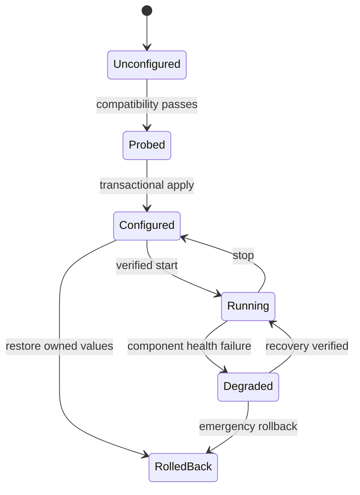

# State, Configuration and Rollback

## State files

`state.json` contains non-secret operational state. `ownership.json` contains configuration ownership records. Both use explicit `schema_version` and transactional migration.

The Phase 1 store persists these documents independently. It writes a unique synced sibling candidate, creates an immutable synced recovery marker, performs a final hash CAS, and commits through `ReplaceFileW` for an existing target or same-directory `MoveFileExW` with write-through for first creation. Recovery derives the outcome from target/candidate/backup hashes rather than a mutable stage field. Reads never perform recovery implicitly.

This provides a crash-consistent application-level old-or-new guarantee under tested Windows semantics. Each document mutation now holds a canonical-target per-file lock from the initial read through commit, verification and cleanup, closing the cooperating-writer CAS/replace window. It does not claim cross-document atomicity or an absolute power-loss guarantee for every filesystem and storage stack. Real product-root ACL initialization remains separate Phase 1 work.

Minimum state:

```json
{
  "schema_version": 1,
  "install_id": "random opaque id",
  "active_upstream_version": "",
  "instances": {
    "codex": {"port": 8317, "config_hash": "", "status": "stopped"},
    "google": {"port": 8318, "config_hash": "", "status": "stopped"}
  },
  "antigravity": {
    "mode": "disabled",
    "bridge_port": 51074,
    "donor_model_id": "",
    "catalog_fingerprint": "",
    "adapter_version": ""
  },
  "codex": {"adapter_version": "", "catalog_fingerprint": ""},
  "accounts": []
}
```

No token, client key, management key, OAuth state, raw email or prompt data belongs here.

## State machine



Transitions are explicit operations with preconditions and journal entries. Startup detects and resolves/rolls back an incomplete transition before normal work.

## Ownership record

For every external config mutation store:

- canonical target path;
- format and encoding/BOM/newline style;
- file identity and pre-write hash;
- owned key path;
- whether key/table existed;
- original typed value;
- applied typed value;
- backup path and backup hash;
- apply timestamp and tool version;
- post-write hash;
- rollback status.

Sensitive config values must be protected or represented by a safe secret reference.

## Transactional patch algorithm

1. Acquire a per-target file lock.
2. Read bytes once; capture metadata, ACL summary and hash.
3. Parse with a format-aware parser that preserves unrelated values.
4. Verify the expected prior hash/state if this is a repeated operation.
5. Create a timestamped backup before mutation.
6. Apply only registered key edits to an in-memory document.
7. Serialize to a sibling temporary file with restrictive ACL.
8. Flush file data; parse it again and validate desired keys/unrelated semantic content.
9. Recheck target hash to detect an external concurrent edit.
10. Atomically replace the target; preserve safe metadata where supported.
11. Read/parse final file and write the ownership journal atomically.
12. On any failure before replace, leave target untouched; after replace, restore backup if validation fails.

## Owned keys

Antigravity owns only the exact proven Cloud Code base URL key.

Codex owns only:

- top-level `model`;
- top-level `model_provider`;
- table `model_providers.dualpool_codex`;
- `model_catalog_json` only when the exact-version fallback is active.

The implementation must not normalize/reformat the entire file unnecessarily. If the parser cannot preserve an acceptable diff, use a documented surgical patch strategy or block.

## Rollback semantics

`poolbridge rollback all`:

1. acquires global operation lock;
2. stops bridge traffic and child processes cleanly;
3. restores each owned key to original value/presence if the current value is still the value applied by Poolbridge;
4. detects user edits and reports a conflict instead of overwriting them;
5. removes only generated catalog reference/file owned by Poolbridge;
6. leaves CLIProxyAPI binary and OAuth auth directories intact;
7. verifies target configs parse and prior semantics are restored;
8. marks state `rolled_back` with evidence.

Emergency Antigravity rollback is a minimal standalone code path that needs neither CLIProxyAPI nor bridge availability.

## Backup retention

Keep at least the pre-install snapshot, most recent successful snapshot, and snapshots referenced by unresolved ownership transactions. Rotation may remove older unreferenced backups only after hash verification. Backups containing sensitive config inherit restrictive ACLs and are never included in ZIP/report artifacts.

## Concurrency

The global lock is the future operation-orchestration primitive; a per-file lock serializes one canonical target mutation. The Store internally acquires the per-document lock for `SaveState`, `SaveOwnership`, recovery and orphan cleanup. Ordinary loads remain read-only: a live mutation lock plus marker is reported as mutation in progress, while a marker without a verified live owner requires explicit recovery.

Lock ownership uses PID, the raw 64-bit Windows process creation FILETIME, canonical executable image and an opaque operation ID. Expiry is diagnostic metadata and never permits stealing a lock from an exact live owner. Stale removal requires two byte-identical reads and repeated owner-identity verification, followed by one bounded acquisition retry. An unverifiable owner or invalid record fails closed.

Future operations that require both lock classes acquire `GLOBAL` before `PER-FILE`. Operations needing multiple file locks acquire them by ascending resource ID.
